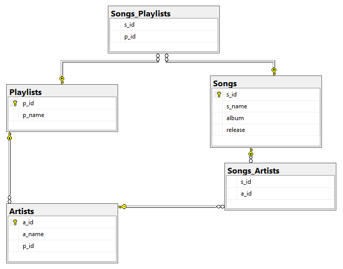

# 🎵 YTMusic_Playlist_Scraper
An Automated pipeline combining **Python**, **Selenium**, and **SQL** to scrape, clean, and store YouTube Music playlists in a relational database.

---

## ⚙️ Tools Used
- **Python** (Selenium, Pandas, JSON for cookies, Requests)
- **SQL** (Schema design, Database creation, Normalization)
- **Excel** (Data review, cleaning, structuring)

---

## 🎯 Overview & Purpose

This project connects three key technologies — **Python**, **Excel**, and **SQL** — to create a full data pipeline:
1. Automated login to YouTube Music using Selenium and Chrome in debugging mode.
2. Playlist scraping with dynamic scrolling and XPath-based element detection.
3. Data transfer from Excel into an SQL Server database using pyodbc and pandas.
- Designed to automate scraping for a multitude of playlists (100K+ songs) - no manual entry required.
- Once imported, data can be analyzed and queried directly in SQL.

---

## 🗃️ Database Design





---

## 📦 SQL Database & Table Creation

```sql
create database Playlists;
use Playlists;

create table Playlists (
	p_id int primary key,
	p_name	varchar(30),
);

create table Artists (
	a_id int primary key,
	a_name varchar(20),
	p_id int,
	constraint fk_p_id_artists foreign key (p_id) references Playlists
);

create table Songs (
	s_id int primary key,
	s_name varchar(30),
	album varchar(30),
	release date,
	p_id int,
	constraint fk_p_id_songs foreign key (p_id) references Playlists
);

create table Songs_Artists (
	s_id int,
	a_id int,
	constraint fk_s_id_songs_artists foreign key (s_id) references Songs,
	constraint fk_a_id_songs_artists foreign key (a_id) references Artists
);

```markdown

-After running the first 2 Python scripts you get all data. Here is an
🧠 Example Output

Playlist: Black Music - Best Of
-   Song: Ready or Not Here I Come (Can't Hide from Love), Artist: The Delfonics, Album: The Sound Of Sexy Soul
-   Song: After Laughter (Comes Tears), Artist: Wendy Rene, Album: Stax-Volt: The Complete Singles 1959-1968
-   Song: Just Memories, Artist: Eddie Kendricks, Album: Keep On Truckin’: The Motown Solo Albums, Vol. 1
-   Song: Groovin', Artist: Willie Mitchell, Album: Solid Soul
-   Song: Hard Times, Artist: Baby Huey, Album: The Baby Huey Story: The Living Legend
-   Song: Anywhere in Glory, Artist: The Mighty Indiana Travelers, Album: LAMP Records - It Glowed Like the Sun: The Story of Naptown's Motown (1969-1972)
-   Song: Free, Artist: Deniece Williams, Album: This Is Niecy (Expanded Edition)
-   Song: You've Really Got A Hold On Me, Artist: The Miracles, Album: The Chaperone
-   Song: Turn on Some Music, Artist: Marvin Gaye, Album: Midnight Love
-   Song: 'Til Tomorrow, Artist: Marvin Gaye, Album: Midnight Love
-   Song: Love's In Need Of Love Today, Artist: Stevie Wonder, Album: Songs In The Key Of Life
-   Song: Give You What I Got, Artist: Wendy Rene, Album: Stax-Volt: The Complete Singles 1959-1968
-   Song: I'd Rather Go Blind, Artist: Etta James, Album: Tell Mama
-   Song: Inside My Love, Artist: Minnie Riperton, Album: Adventures In Paradise
-   Song: 溫泉鄉的吉他, Artist: 李雅芳, Album: 一曲情未了
-   Song: Love Ballad, Artist: L.T.D., Album: Love To The World

Playlist: Purity Ring - Best Of
-   Song: belispeak, Artist: Purity Ring, Album: shrines
-   Song: obedear, Artist: Purity Ring, Album: shrines
-   Song: lofticries, Artist: Purity Ring, Album: shrines
-   Song: fineshrine, Artist: Purity Ring, Album: shrines
-   Song: heartsigh, Artist: Purity Ring, Album: another eternity
-   Song: push pull, Artist: Purity Ring, Album: another eternity
-   Song: bodyache, Artist: Purity Ring, Album: another eternity
-   Song: begin again, Artist: Purity Ring, Album: another eternity
-   Song: pink lightning, Artist: Purity Ring, Album: Womb
-   Song: sinew, Artist: Purity Ring, Album: Womb
-   Song: peacefall, Artist: Purity Ring, Album: Womb
-   Song: i like the devil, Artist: Purity Ring, Album: Womb
-   Song: stardew, Artist: Purity Ring, Album: Womb
-   Song: neverend, Artist: Purity Ring, Album: graves
-   Song: soshy, Artist: Purity Ring, Album: graves
-   Song: graves, Artist: Purity Ring, Album: graves

⚠️ Note on Login / Cookies

Due to YouTube Music’s authentication structure, session cookies must be manually updated to enable login automation.
This project demonstrates the scraping and database design logic, but running it fully requires:
- Valid user session cookies
- Selenium WebDriver setup
- Basic knowledge of browser debugging tools

🔍 Learnings

- Handling real-world cookie authentication challenges
- Structuring clean SQL schemas for scraped data
- Debugging Selenium and timing issues in dynamic pages
- Using Excel as a lightweight staging layer before SQL import

💬 Summary

This project demonstrates my ability to:

Automate data extraction, manage large datasets, and integrate multiple tools into a cohesive workflow — from web scraping to database management.
